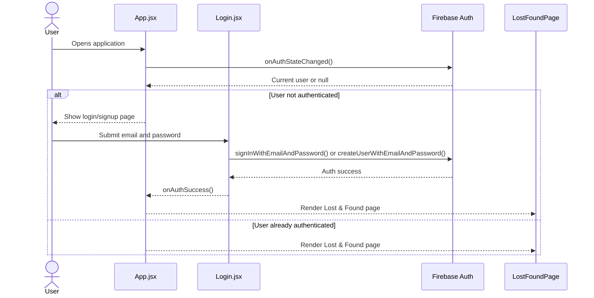
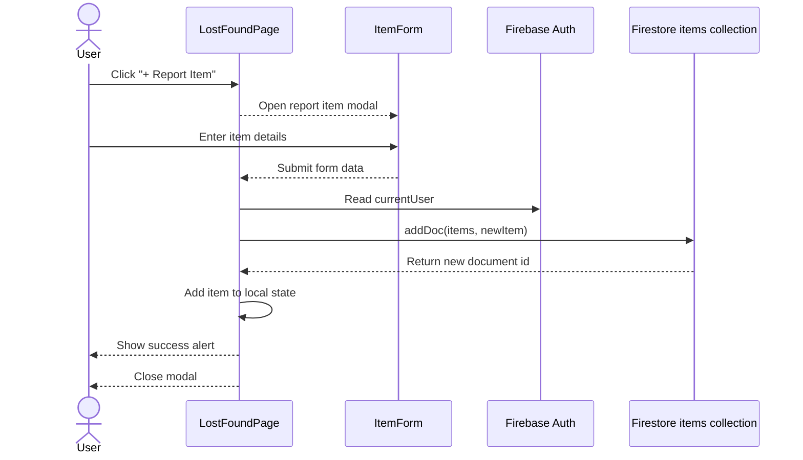
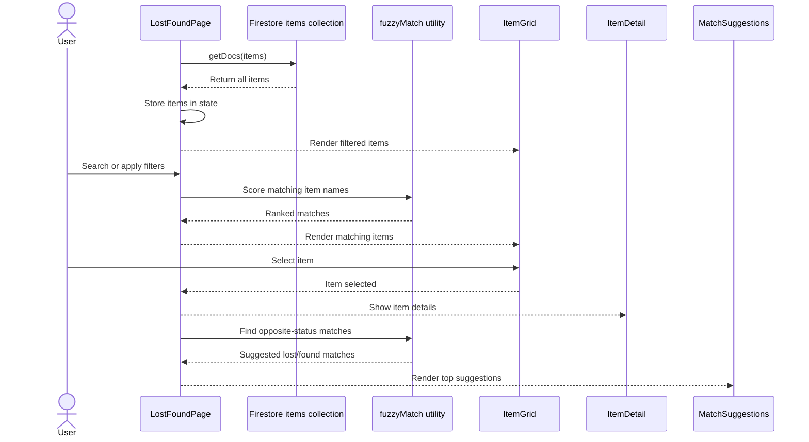
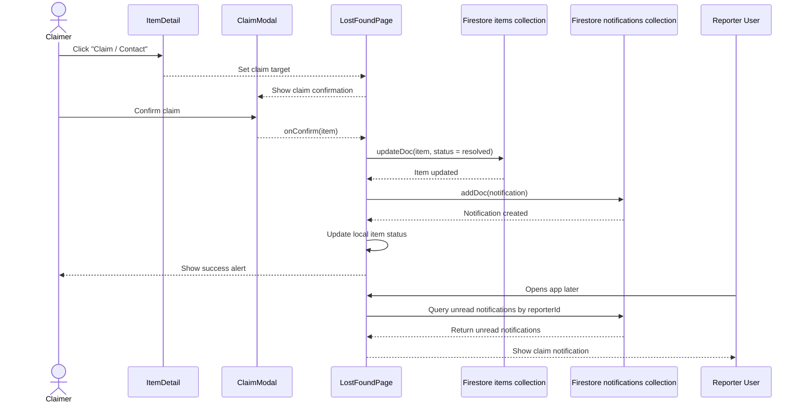

# Campus Connect - Sequence Diagrams

## Authentication Sequence

```mermaid
sequenceDiagram
    actor User
    participant App as App.jsx
    participant Login as Login.jsx
    participant Auth as Firebase Auth
    participant LostFound as LostFoundPage

    User->>App: Opens application
    App->>Auth: onAuthStateChanged()
    Auth-->>App: Current user or null

    alt User not authenticated
        App-->>User: Show login/signup page
        User->>Login: Submit email and password
        Login->>Auth: signInWithEmailAndPassword() or createUserWithEmailAndPassword()
        Auth-->>Login: Auth success
        Login-->>App: onAuthSuccess()
        App-->>LostFound: Render Lost & Found page
    else User already authenticated
        App-->>LostFound: Render Lost & Found page
    end
```

## Report Lost/Found Item Sequence

```mermaid
sequenceDiagram
    actor User
    participant UI as LostFoundPage
    participant Form as ItemForm
    participant Auth as Firebase Auth
    participant DB as Firestore items collection

    User->>UI: Click "+ Report Item"
    UI-->>Form: Open report item modal
    User->>Form: Enter item details
    Form-->>UI: Submit form data

    UI->>Auth: Read currentUser
    UI->>DB: addDoc(items, newItem)
    DB-->>UI: Return new document id

    UI->>UI: Add item to local state
    UI-->>User: Show success alert
    UI-->>User: Close modal
```

## Browse, Search, and Match Sequence

```mermaid
sequenceDiagram
    actor User
    participant UI as LostFoundPage
    participant DB as Firestore items collection
    participant Match as fuzzyMatch utility
    participant Grid as ItemGrid
    participant Detail as ItemDetail
    participant Suggestions as MatchSuggestions

    UI->>DB: getDocs(items)
    DB-->>UI: Return all items
    UI->>UI: Store items in state
    UI-->>Grid: Render filtered items

    User->>UI: Search or apply filters
    UI->>Match: Score matching item names
    Match-->>UI: Ranked matches
    UI-->>Grid: Render matching items

    User->>Grid: Select item
    Grid-->>UI: Item selected
    UI-->>Detail: Show item details
    UI->>Match: Find opposite-status matches
    Match-->>UI: Suggested lost/found matches
    UI-->>Suggestions: Render top suggestions
```

## Claim Item Sequence

```mermaid
sequenceDiagram
    actor Claimer
    participant Detail as ItemDetail
    participant Modal as ClaimModal
    participant UI as LostFoundPage
    participant ItemsDB as Firestore items collection
    participant NotifDB as Firestore notifications collection
    participant Reporter as Reporter User

    Claimer->>Detail: Click "Claim / Contact"
    Detail-->>UI: Set claim target
    UI-->>Modal: Show claim confirmation

    Claimer->>Modal: Confirm claim
    Modal-->>UI: onConfirm(item)

    UI->>ItemsDB: updateDoc(item, status = resolved)
    ItemsDB-->>UI: Item updated

    UI->>NotifDB: addDoc(notification)
    NotifDB-->>UI: Notification created

    UI->>UI: Update local item status
    UI-->>Claimer: Show success alert

    Reporter->>UI: Opens app later
    UI->>NotifDB: Query unread notifications by reporterId
    NotifDB-->>UI: Return unread notifications
    UI-->>Reporter: Show claim notification
```
